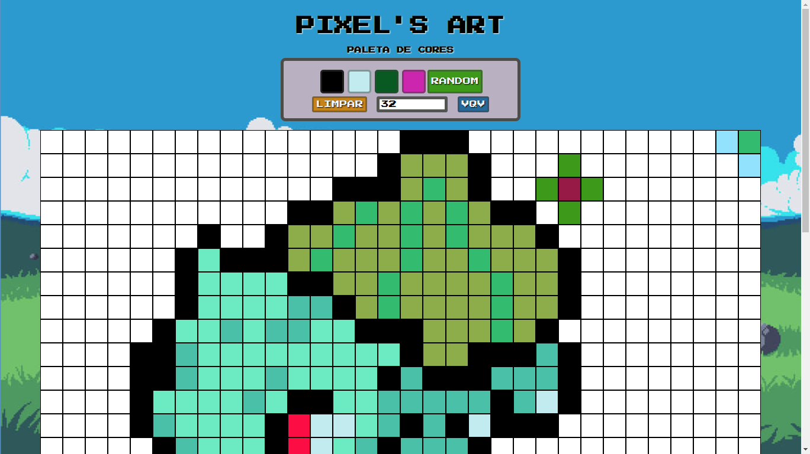

# Pixels Art

Este é o projeto "Pixels Art", desenvolvido durante o curso de Desenvolvimento Web na Trybe.
Trata-se de uma aplicação simples que permite criar arte em pixel, similar a um editor de pixel art.

## Funcionalidades

- Criar uma grade de pixels na tela.
- Selecionar uma cor da paleta de cores.
- Pintar os pixels da grade com a cor selecionada.
- Limpar a tela e recomeçar a criação da arte.

## Tecnologias Utilizadas

- HTML5
- CSS3
- JavaScript

## Como Usar

1. Faça o download ou clone este repositório.
2. Navegue até o diretório do projeto.
3. Abra o arquivo `index.html` em seu navegador.
4. Você verá a grade de pixels e a paleta de cores.
5. Selecione uma cor da paleta.
6. Clique em um pixel da grade para preenchê-lo com a cor selecionada.
7. Para limpar a tela, clique no botão "Limpar".

## Contribuição

Contribuições são bem-vindas! Se você deseja contribuir com melhorias para este projeto, siga as etapas abaixo:

1. Faça um fork deste repositório.
2. Crie um branch com sua feature/correção: `git checkout -b minha-feature`.
3. Commit suas mudanças: `git commit -m 'Minha nova feature'`.
4. Push para o branch criado: `git push origin minha-feature`.
5. Abra um Pull Request.

## Autor

- Fran Ribeiro
- [GitHub](https://github.com/ribeirofrv/)
- E-mail: ribeirofrv@gmail.com

## Licença

Este projeto está licenciado sob a Licença [MIT](https://opensource.org/licenses/MIT).
